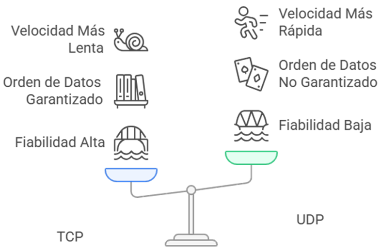

https://github.com/maridilo/ExamenRedes2.git

# Examen de Redes II – En Busca de la Red Perdida

## Parte I: Conceptos y Teoría

### 1. El Mural de las Siete Capas
Te adentras en la sala principal del templo y descubres un gran mural compuesto por **siete franjas horizontales** superpuestas, decoradas con símbolos y jeroglíficos. Cada franja representa un nivel diferente en un ritual de comunicación. Los sabios de esta civilización entendían que un mensaje debía pasar por **varias etapas** desde su origen hasta su destino, refinándose o traduciendo su forma en cada nivel de la pirámide comunicativa. 
#### Pregunta: 
¿Qué representa el mural de las siete capas en términos de las redes de comunicación modernas? Identifica brevemente cada capa y explica cómo se relaciona este antiguo “modelo” con el proceso de comunicación de datos actual.

#### Respuesta:
El mural de las siete capas en términos de las redes de comunicación modernas representa el **modelo OSI (Open Systems Interconnection)**, que describe como los datos viajan desde un dispositivo emisor hasta un receptor en una red de comunicaciones. Cada capa del modelo OSI realiza funciones específicas que ayudan a encapsular, transportar, interpretar o entregar correctamente la información.
Este modelo divide el proceso de comunicación en siete capas jerárquicas, desde el software mas cercano al usuario hasta el hardware físico de transmisión.
Estas capas son:

---

### 2. Los Dos Pergaminos del Mensajero
En una cámara oculta encuentras dos pergaminos polvorientos. El primero describe el **Ritual del Mensajero Confiable**: antes de entregar un mensaje, el mensajero realiza un saludo de tres pasos con el receptor para asegurarse de que ambos estén listos, luego entrega el mensaje y espera una confirmación de recibido. Si la confirmación no llega, reintenta el envío.
 El segundo pergamino narra el **Ritual del Mensajero Veloz**: un mensajero que sale disparado a entregar mensajes sucesivos sin aviso previo ni asegurarse de la recepción, cubriendo la mayor distancia en el menor tiempo, aunque a veces los mensajes se pierdan en el camino.
#### Pregunta:
Interpreta los dos rituales descritos. ¿A qué protocolos de comunicación actuales equivalen el mensajero confiable y el mensajero veloz? Compara sus características, explicando las ventajas y desventajas de cada enfoque en redes modernas.

#### Respuesta:
Estos dos rituales descritos se tratan de dos protocolos de comunicación actuales: el TCP (Transmission Control Protocol) y UDP (User Datagram Protocol).

El que equivale al **mensajero confiable es el protocolo TCP**. Este ritual descrito se trata del funcionamiento del TCP, orientado a la conexión fiable. El saludo de tres pasos corresponde al proceso de establecimiento de conexión conocido como “three-way handshake”, que asegura que tanto el emisor como el receptor estén listos para la comunicación. Además, garantiza la entrega: si no se recibe una confirmación (ACK) del mensaje, lo retransmite.

#### Características:
-	**Conexión Orientada**: requiere establecer una conexión antes de enviar los datos.
-	**Entrega garantizada**: los datos llegan completos, en orden y sin duplicados.
-	**Control de flujo**: ajusta la transmisión para no saturar la red.
-	**Recursos**: más pesado por su mayor uso del CPU y ancho de banda.
  
#### Ventajas:
-	**Fiabilidad**: ideal para aplicaciones donde perder datos no es viable (ejemplo: navegación web, correo electrónico, transferencia de archivos).
-	**Orden y control**: mantiene una secuencia correcta de los paquetes.
  
#### Desventajas:
-	**Mayor latencia**: al establecer la conexión y las confirmaciones.
-	**Sobrecarga de red**: por el control de errores, ACKs y retransmisiones.

**El mensajero veloz equivale al protocolo UDP**, que no es orientado a conexión. El mensajero envía los datos sin establecer ningún contacto previo, ni esperar confirmación. Su objetivo es la velocidad y eficiencia, aun a costa de que algunos mensajes puedan perderse en el camino.

#### Características:
-	**No necesita conexión**: se envía sin verificar que el receptor esté disponible.
-	**No garantiza la entrega** ni el orden: los datos pueden perderse en el camino o llegar desordenados.
-	**Bajo consumo** de recursos: porque no tiene mecanismos de corrección o confirmación.
  
#### Ventajas:
-	**Rápido** y con baja latencia: perfecto para transmisiones en tiempo real.
-	**Menos sobrecarga**: útil en redes con limitaciones en el ancho de banda.
  
#### Desventajas:
-	**No es fiable**: si un paquete se pierde, no se recupera automáticamente.
-	**Sin control de flujo**: posibilidad de saturar el receptor si hay demasiada información.

---
   
### 3. El Enigma de las Subredes
Avanzando por un pasillo, encuentras una losa de piedra con inscripciones que parecen ser direcciones numéricas. Una inscripción cuenta: "Nuestro reino digital tenía la dirección sagrada 192.168.50.0. Los cuatro grandes gremios de la ciudad exigían su propio distrito en la red, todos de igual tamaño". Junto a esto, ves un diagrama borroso de algo que parecen ser subredes emanando de la dirección principal, cada una con su propio identificador. 
#### Pregunta:
Descifra el enigma de la losa. Si la antigua red usaba la dirección 192.168.50.0 como base y necesitaba dividirse en 4 subredes de igual tamaño (una para cada gremio), ¿qué máscara de subred habrían utilizado los antiguos para lograrlo? ¿Cuántas direcciones de host (utilizables) tendría cada subred resultante? Explica brevemente tu razonamiento al calcular la máscara.

#### Respuesta:
La antigua red cuenta con la dirección base **192.168.50.0**, que corresponde a una red privada de clase C, configurada con una máscara **/24 (255.255.255.0)**. Esta ofrece 2^8=**256** direcciones IP totales, de los cuales 254 son utilizables para hosts (los extremos se reservan para red y broadcast).

Los 4 gremios necesitan una subred cada uno de igual tamaño, que seria dividir la red original en 4 subredes de igual capacidad aplicando subnetting.
Para crear estas 4 redes iguales se necesitan 2 adicionales (2^2 = 4 subredes). Al sumarlos a la mascara original /24 se obtiene **/26**, es decir, **255.255.255.192**. 
-> 26 bits = 24 originales + 2 bits para subredes.

Un bloque **/26** tiene **64** direcciones totales (2^6), de las cuales **62 son utilizables para hosts por subred**, ya que una se reserva para la dirección de red y otra para broadcast.
Subredes generadas:
1.	192.168.50.0/26 → Hosts: 192.168.50.1 a 192.168.50.62
2.	192.168.50.64/26 → Hosts: 192.168.50.65 a 192.168.50.126
3.	192.168.50.128/26 → Hosts: 192.168.50.129 a 192.168.50.190
4.	192.168.50.192/26 → Hosts: 192.168.50.193 a 192.168.50.254

---
   
### 7. La Encrucijada de las Rutas

---
   
### 9. El Guardián de la Máscara Única

---

## Parte II: Práctica con Cisco Packet Tracer
### Ejercicio 1 – La Ruta Perdida entre Dos Reinos

- Descripción
  
- Topología
  
- Direccionamiento IP
  
- Comandos configurados
  
- Capturas de configuración
  
- Pruebas de conectividad
  

### Ejercicio 2 – La Ciudad de las Redes Aisladas
- Descripción
  
- Topología
  
- VLANs y subinterfaces
  
- Comandos configurados
  
- Capturas de configuración
  
- Pruebas de conectividad
  
