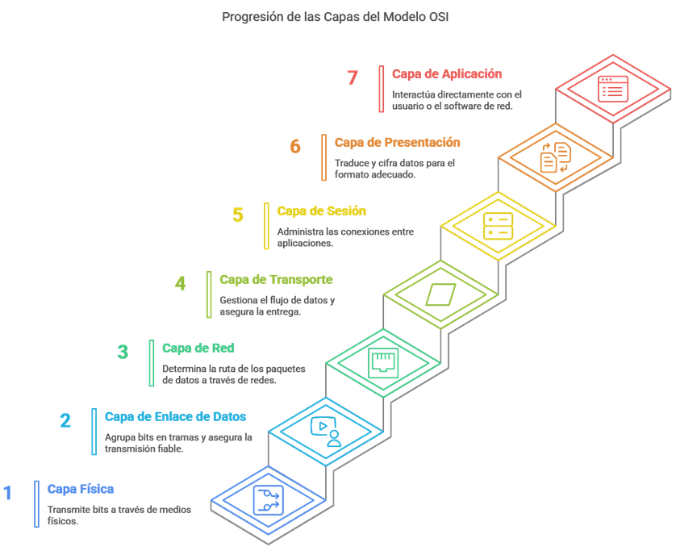

https://github.com/maridilo/ExamenRedes2.git

# Examen de Redes II – En Busca de la Red Perdida

## Parte I: Conceptos y Teoría

### 1. El Mural de las Siete Capas
Te adentras en la sala principal del templo y descubres un gran mural compuesto por siete franjas horizontales superpuestas, decoradas con símbolos y jeroglíficos. Cada franja representa un nivel diferente en un ritual de comunicación. Los sabios de esta civilización entendían que un mensaje debía pasar por varias etapas desde su origen hasta su destino, refinándose o traduciendo su forma en cada nivel de la pirámide comunicativa. 
Pregunta: ¿Qué representa el mural de las siete capas en términos de las redes de comunicación modernas? Identifica brevemente cada capa y explica cómo se relaciona este antiguo “modelo” con el proceso de comunicación de datos actual.

El mural de las siete capas en términos de las redes de comunicación modernas representa el modelo OSI (Open Systems Interconnection), que describe como los datos viajan desde un dispositivo emisor hasta un receptor en una red de comunicaciones. Cada capa del modelo OSI realiza funciones específicas que ayudan a encapsular, transportar, interpretar o entregar correctamente la información.
Este modelo divide el proceso de comunicación en siete capas jerárquicas, desde el software mas cercano al usuario hasta el hardware físico de transmisión. Estas capas son:

---
   
### 3. Los Dos Pergaminos del Mensajero

---
   
### 5. El Enigma de las Subredes

---
   
### 7. La Encrucijada de las Rutas

---
   
### 9. El Guardián de la Máscara Única

---

## Parte II: Práctica con Cisco Packet Tracer
### Ejercicio 1 – La Ruta Perdida entre Dos Reinos

- Descripción
  
- Topología
  
- Direccionamiento IP
  
- Comandos configurados
  
- Capturas de configuración
  
- Pruebas de conectividad
  

### Ejercicio 2 – La Ciudad de las Redes Aisladas
- Descripción
  
- Topología
  
- VLANs y subinterfaces
  
- Comandos configurados
  
- Capturas de configuración
  
- Pruebas de conectividad
  
